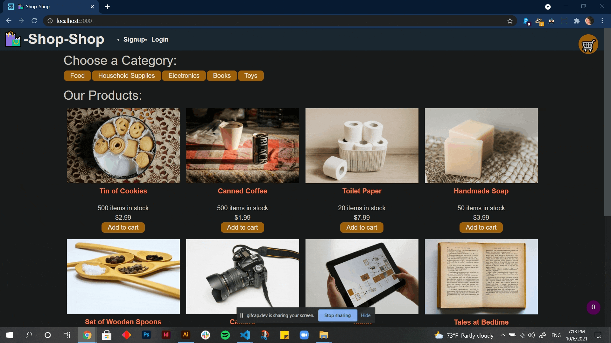

# 22 - Redux Store

## Table of Contents

- [Description](#description)
- [Installation](#installation)
- [Screenshot](#screenshot)
- [Link](#link)
- [Contact](#contact)

## Description

This is an e-commerce application refactor to use Redux instead of Context API.

## Installation

This app requires the following dependencies:
- apollo-server-express
- graphql
- react-redux

## Screenshot

## Link
https://dry-gorge-91198.herokuapp.com/

## Contact

Mehalet KesateBirhan  
Github: https://github.com/MehaletKB 
email: tatybcoding@gmail.com
